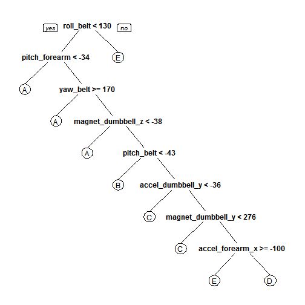

### Practical Machine Learning Course Project

## Title: Predict Human Activity 

### Synopsis

Using devices such as Jawbone Up, Nike FuelBand, and Fitbit it is now possible to collect a large amount of data about personal activity relatively inexpensively. These type of devices are part of the quantified self movement - a group of enthusiasts who take measurements about themselves regularly to improve their health, to find patterns in their behavior, or because they are tech geeks. One thing that people regularly do is quantify how much of a particular activity they do, but they rarely quantify how well they do it. The goal of this project will be to use data from accelerometers on the belt, forearm, arm, and dumbell of 6 participants of the study<sup>1</sup>. They were asked to perform barbell lifts correctly and incorrectly in 5 different ways. 

More information and data are available from the source website of the study<sup>1</sup>: http://groupware.les.inf.puc-rio.br/har

<pre>[1] <i>Ugulino, W.; Cardador, D.; Vega, K.; Velloso, E.; Milidiu, R.; Fuks, H.</i> Wearable Computing: Accelerometers' Data Classification of Body Postures and Movements. Proceedings of 21st Brazilian Symposium on Artificial Intelligence. Advances in Artificial Intelligence - SBIA 2012. In: Lecture Notes in Computer Science. , pp. 52-61. Curitiba, PR: Springer Berlin / Heidelberg, 2012. ISBN 978-3-642-34458-9. DOI: 10.1007/978-3-642-34459-6_6.</pre>

### Prediction Problem

In his second lecture, the Professor of this course introduces the "Components of a Predictor" and defines six stages:

question -> input data -> features -> algorithm -> parameters -> evaluation

So, we have decided to proceed along this stages and first of all we load the libraries that we will use:


### (1) Question

As we know, the 6 participants of the study were asked to perform barbell lifts correctly and incorrectly in 5 different ways. The 5 ways, as described in the study<sup>1</sup>, were exactly according to the specification (Class A), throwing the elbows to the front (Class B), lifting the dumbbell only halfway (Class C), lowering the dumbbell only halfway (Class D) and throwing the hips to the front (Class E). Class A corresponds to the specified execution of the exercise, while the other 4 classes correspond to common mistakes. By processing data gathered from accelerometers on the belt, forearm, arm, and dumbell of the participants in a machine learning algorithm, the question is <i>can the appropriate activity quality (class A to E) be predicted</i>?

### (2) Input Data

The first step is to load the data. 

The train data are available from this url: https://d396qusza40orc.cloudfront.net/predmachlearn/pml-training.csv and the test data are available from this url: https://d396qusza40orc.cloudfront.net/predmachlearn/pml-testing.csv. We can download those data sets using the <i>download.file()</i> command, but we will assume that the data have been previously downloaded to our working directory. Then we will load both data sets and verify they have identical columns.


```r
# Download training data set
url <- "https://d396qusza40orc.cloudfront.net/predmachlearn/pml-training.csv"
file <- "pml-training.csv"
# download.file(url, destfile=file, method='curl') Download test data set
url <- "https://d396qusza40orc.cloudfront.net/predmachlearn/pml-testing.csv"
file <- "pml-testing.csv"
# download.file(url, destfile=file, method='curl')

# Load data (treating empty values as NA)
trn <- read.csv("pml-training.csv", header = T, na.strings = c("NA", ""))
tst <- read.csv("pml-testing.csv", header = T, na.strings = c("NA", ""))

# Colnames of both sets
cols_trn <- colnames(trn)
cols_tst <- colnames(tst)

# Verify that columns are identical in both sets (excluding columns 'classe'
# and 'problem_id')
all.equal(cols_trn[1:length(cols_trn) - 1], cols_tst[1:length(cols_tst) - 1])
```

```
## [1] TRUE
```


### (3) Features

We have verified that both the training and testing set are identical (excluding last column representing the outcome). We decided to eliminate NA and missing data columns:


```r
# Build vector of NA and missing data for dropping
idx <- as.vector(apply(trn, 2, function(x) length(which(!is.na(x)))))
toDrop <- c()
for (cnt in 1:length(idx)) {
    if (idx[cnt] < nrow(trn)) {
        toDrop <- c(toDrop, cols_trn[cnt])
    }
}

# Drop the missing data and the first 7 columns because they are not
# necessary for predicting
trn <- trn[, !(names(trn) %in% toDrop)]
trn <- trn[, 8:length(colnames(trn))]

tst <- tst[, !(names(tst) %in% toDrop)]
tst <- tst[, 8:length(colnames(tst))]

# Show remaining columns
colnames(trn)
```

```
##  [1] "roll_belt"            "pitch_belt"           "yaw_belt"            
##  [4] "total_accel_belt"     "gyros_belt_x"         "gyros_belt_y"        
##  [7] "gyros_belt_z"         "accel_belt_x"         "accel_belt_y"        
## [10] "accel_belt_z"         "magnet_belt_x"        "magnet_belt_y"       
## [13] "magnet_belt_z"        "roll_arm"             "pitch_arm"           
## [16] "yaw_arm"              "total_accel_arm"      "gyros_arm_x"         
## [19] "gyros_arm_y"          "gyros_arm_z"          "accel_arm_x"         
## [22] "accel_arm_y"          "accel_arm_z"          "magnet_arm_x"        
## [25] "magnet_arm_y"         "magnet_arm_z"         "roll_dumbbell"       
## [28] "pitch_dumbbell"       "yaw_dumbbell"         "total_accel_dumbbell"
## [31] "gyros_dumbbell_x"     "gyros_dumbbell_y"     "gyros_dumbbell_z"    
## [34] "accel_dumbbell_x"     "accel_dumbbell_y"     "accel_dumbbell_z"    
## [37] "magnet_dumbbell_x"    "magnet_dumbbell_y"    "magnet_dumbbell_z"   
## [40] "roll_forearm"         "pitch_forearm"        "yaw_forearm"         
## [43] "total_accel_forearm"  "gyros_forearm_x"      "gyros_forearm_y"     
## [46] "gyros_forearm_z"      "accel_forearm_x"      "accel_forearm_y"     
## [49] "accel_forearm_z"      "magnet_forearm_x"     "magnet_forearm_y"    
## [52] "magnet_forearm_z"     "classe"
```

```r
colnames(tst)
```

```
##  [1] "roll_belt"            "pitch_belt"           "yaw_belt"            
##  [4] "total_accel_belt"     "gyros_belt_x"         "gyros_belt_y"        
##  [7] "gyros_belt_z"         "accel_belt_x"         "accel_belt_y"        
## [10] "accel_belt_z"         "magnet_belt_x"        "magnet_belt_y"       
## [13] "magnet_belt_z"        "roll_arm"             "pitch_arm"           
## [16] "yaw_arm"              "total_accel_arm"      "gyros_arm_x"         
## [19] "gyros_arm_y"          "gyros_arm_z"          "accel_arm_x"         
## [22] "accel_arm_y"          "accel_arm_z"          "magnet_arm_x"        
## [25] "magnet_arm_y"         "magnet_arm_z"         "roll_dumbbell"       
## [28] "pitch_dumbbell"       "yaw_dumbbell"         "total_accel_dumbbell"
## [31] "gyros_dumbbell_x"     "gyros_dumbbell_y"     "gyros_dumbbell_z"    
## [34] "accel_dumbbell_x"     "accel_dumbbell_y"     "accel_dumbbell_z"    
## [37] "magnet_dumbbell_x"    "magnet_dumbbell_y"    "magnet_dumbbell_z"   
## [40] "roll_forearm"         "pitch_forearm"        "yaw_forearm"         
## [43] "total_accel_forearm"  "gyros_forearm_x"      "gyros_forearm_y"     
## [46] "gyros_forearm_z"      "accel_forearm_x"      "accel_forearm_y"     
## [49] "accel_forearm_z"      "magnet_forearm_x"     "magnet_forearm_y"    
## [52] "magnet_forearm_z"     "problem_id"
```


As it was discussed in the course there are two levels of covariates creation strategies: Level 1 (raw data to covariates) and Level 2 (covariates to new covariates). Because we are supplied with the raw sensor data, there is no need Level 1 processing. However, some Level 2 processing is certainly worth attempting. So, we will check for covariates that basically have no variablility. We will use nearZeroVar() in caret package for this:
        


```r
nzv <- nearZeroVar(trn, saveMetrics = TRUE)
nzv
```

```
##                      freqRatio percentUnique zeroVar   nzv
## roll_belt                1.102       6.77811   FALSE FALSE
## pitch_belt               1.036       9.37723   FALSE FALSE
## yaw_belt                 1.058       9.97350   FALSE FALSE
## total_accel_belt         1.063       0.14779   FALSE FALSE
## gyros_belt_x             1.059       0.71348   FALSE FALSE
## gyros_belt_y             1.144       0.35165   FALSE FALSE
## gyros_belt_z             1.066       0.86128   FALSE FALSE
## accel_belt_x             1.055       0.83580   FALSE FALSE
## accel_belt_y             1.114       0.72877   FALSE FALSE
## accel_belt_z             1.079       1.52380   FALSE FALSE
## magnet_belt_x            1.090       1.66650   FALSE FALSE
## magnet_belt_y            1.100       1.51870   FALSE FALSE
## magnet_belt_z            1.006       2.32902   FALSE FALSE
## roll_arm                52.338      13.52563   FALSE FALSE
## pitch_arm               87.256      15.73234   FALSE FALSE
## yaw_arm                 33.029      14.65702   FALSE FALSE
## total_accel_arm          1.025       0.33636   FALSE FALSE
## gyros_arm_x              1.016       3.27693   FALSE FALSE
## gyros_arm_y              1.454       1.91622   FALSE FALSE
## gyros_arm_z              1.111       1.26389   FALSE FALSE
## accel_arm_x              1.017       3.95984   FALSE FALSE
## accel_arm_y              1.140       2.73672   FALSE FALSE
## accel_arm_z              1.128       4.03629   FALSE FALSE
## magnet_arm_x             1.000       6.82397   FALSE FALSE
## magnet_arm_y             1.057       4.44399   FALSE FALSE
## magnet_arm_z             1.036       6.44685   FALSE FALSE
## roll_dumbbell            1.022      83.78351   FALSE FALSE
## pitch_dumbbell           2.277      81.22516   FALSE FALSE
## yaw_dumbbell             1.132      83.14137   FALSE FALSE
## total_accel_dumbbell     1.073       0.21914   FALSE FALSE
## gyros_dumbbell_x         1.003       1.22821   FALSE FALSE
## gyros_dumbbell_y         1.265       1.41678   FALSE FALSE
## gyros_dumbbell_z         1.060       1.04984   FALSE FALSE
## accel_dumbbell_x         1.018       2.16594   FALSE FALSE
## accel_dumbbell_y         1.053       2.37489   FALSE FALSE
## accel_dumbbell_z         1.133       2.08949   FALSE FALSE
## magnet_dumbbell_x        1.098       5.74865   FALSE FALSE
## magnet_dumbbell_y        1.198       4.30129   FALSE FALSE
## magnet_dumbbell_z        1.021       3.44511   FALSE FALSE
## roll_forearm            11.589      11.08959   FALSE FALSE
## pitch_forearm           65.983      14.85577   FALSE FALSE
## yaw_forearm             15.323      10.14677   FALSE FALSE
## total_accel_forearm      1.129       0.35674   FALSE FALSE
## gyros_forearm_x          1.059       1.51870   FALSE FALSE
## gyros_forearm_y          1.037       3.77637   FALSE FALSE
## gyros_forearm_z          1.123       1.56457   FALSE FALSE
## accel_forearm_x          1.126       4.04648   FALSE FALSE
## accel_forearm_y          1.059       5.11161   FALSE FALSE
## accel_forearm_z          1.006       2.95587   FALSE FALSE
## magnet_forearm_x         1.012       7.76679   FALSE FALSE
## magnet_forearm_y         1.247       9.54031   FALSE FALSE
## magnet_forearm_z         1.000       8.57711   FALSE FALSE
## classe                   1.470       0.02548   FALSE FALSE
```


As we can see all of the near zero variance variables are FALSE, therefore there is no need to eliminate any covariates due to lack of variablility.

### (4) Algorithm

We have a large training set (19,622 entries) and a small testing set (20 entries). Instead of performing the algorithm on the entire training set, as it would be time consuming and would not allow for an attempt on a testing set, we chose to divide the given training set into four roughly equal sets, each of which was then split into a training set (comprising 60% of the entries) and a testing set (comprising 40% of the entries).


```r
# Divide the training set into 4 roughly equal sets
set.seed(777)
ids_small <- createDataPartition(y = trn$classe, p = 0.25, list = FALSE)
trn_small1 <- trn[ids_small, ]
trn_remain <- trn[-ids_small, ]
set.seed(777)
ids_small <- createDataPartition(y = trn_remain$classe, p = 0.33, list = FALSE)
trn_small2 <- trn_remain[ids_small, ]
trn_remain <- trn_remain[-ids_small, ]
set.seed(777)
ids_small <- createDataPartition(y = trn_remain$classe, p = 0.5, list = FALSE)
trn_small3 <- trn_remain[ids_small, ]
trn_small4 <- trn_remain[-ids_small, ]
rm(ids_small, trn_remain)

# Divide each of these 4 sets into training (60%) and test (40%) sets
set.seed(777)
inTrain <- createDataPartition(y = trn_small1$classe, p = 0.6, list = FALSE)
small_trn1 <- trn_small1[inTrain, ]
small_tst1 <- trn_small1[-inTrain, ]
set.seed(777)
inTrain <- createDataPartition(y = trn_small2$classe, p = 0.6, list = FALSE)
small_trn2 <- trn_small2[inTrain, ]
small_tst2 <- trn_small2[-inTrain, ]
set.seed(777)
inTrain <- createDataPartition(y = trn_small3$classe, p = 0.6, list = FALSE)
small_trn3 <- trn_small3[inTrain, ]
small_tst3 <- trn_small3[-inTrain, ]
set.seed(777)
inTrain <- createDataPartition(y = trn_small4$classe, p = 0.6, list = FALSE)
small_trn4 <- trn_small4[inTrain, ]
small_tst4 <- trn_small4[-inTrain, ]
```


### (5) Paramethers

We decided first to try classification trees and then attemp random forest models with preprocessing and cross validation, of course, using the caret package.

### (6) Evaluation

### (6.a) Classification Trees 

First, we run a classification tree with no extra features:

```r
# Train a tree on training set 1 with no extra features
set.seed(777)
modFit <- train(small_trn1$classe ~ ., data = small_trn1, method = "rpart")
print(modFit, digits = 3)
```

```
## CART 
## 
## 2946 samples
##   52 predictors
##    5 classes: 'A', 'B', 'C', 'D', 'E' 
## 
## No pre-processing
## Resampling: Bootstrapped (25 reps) 
## 
## Summary of sample sizes: 2946, 2946, 2946, 2946, 2946, 2946, ... 
## 
## Resampling results across tuning parameters:
## 
##   cp      Accuracy  Kappa   Accuracy SD  Kappa SD
##   0.0337  0.547     0.422   0.0502       0.0765  
##   0.0376  0.504     0.359   0.0762       0.119   
##   0.114   0.322     0.0519  0.0402       0.0601  
## 
## Accuracy was used to select the optimal model using  the largest value.
## The final value used for the model was cp = 0.0337.
```

We can see that the accuracy reached is 0.547, which is poor.


```r
print(modFit$finalModel, digits = 3)
```

```
## n= 2946 
## 
## node), split, n, loss, yval, (yprob)
##       * denotes terminal node
## 
##   1) root 2946 2110 A (0.28 0.19 0.17 0.16 0.18)  
##     2) roll_belt< 130 2698 1860 A (0.31 0.21 0.19 0.18 0.11)  
##       4) pitch_forearm< -34.5 215    0 A (1 0 0 0 0) *
##       5) pitch_forearm>=-34.5 2483 1860 A (0.25 0.23 0.21 0.19 0.12)  
##        10) yaw_belt>=170 131   13 A (0.9 0.053 0 0.038 0.0076) *
##        11) yaw_belt< 170 2352 1790 B (0.21 0.24 0.22 0.2 0.13)  
##          22) magnet_dumbbell_z< -38.5 714  438 A (0.39 0.34 0.073 0.18 0.028) *
##          23) magnet_dumbbell_z>=-38.5 1638 1180 C (0.14 0.2 0.28 0.21 0.17)  
##            46) pitch_belt< -43.2 93    6 B (0 0.94 0.032 0.011 0.022) *
##            47) pitch_belt>=-43.2 1545 1090 C (0.14 0.15 0.3 0.23 0.18)  
##              94) accel_dumbbell_y< -35.5 149   24 C (0.0067 0.067 0.84 0.04 0.047) *
##              95) accel_dumbbell_y>=-35.5 1396 1050 D (0.16 0.16 0.24 0.25 0.19)  
##               190) magnet_dumbbell_y< 276 573  316 C (0.22 0.066 0.45 0.16 0.11) *
##               191) magnet_dumbbell_y>=276 823  567 D (0.12 0.23 0.094 0.31 0.25)  
##                 382) accel_forearm_x>=-100 510  342 E (0.14 0.31 0.11 0.12 0.33) *
##                 383) accel_forearm_x< -100 313  118 D (0.083 0.1 0.073 0.62 0.12) *
##     3) roll_belt>=130 248    4 E (0.016 0 0 0 0.98) *
```


```r
rpart.plot(modFit$finalModel)
```

 


Now, we do the same but with both preprocessing and cross validation:

```r
# Train on training set 1 with both preprocessing and cross validation.
set.seed(777)
modFit <- train(small_trn1$classe ~ ., preProcess = c("center", "scale"), trControl = trainControl(method = "cv", 
    number = 4), data = small_trn1, method = "rpart")
print(modFit, digits = 3)
```

```
## CART 
## 
## 2946 samples
##   52 predictors
##    5 classes: 'A', 'B', 'C', 'D', 'E' 
## 
## Pre-processing: centered, scaled 
## Resampling: Cross-Validated (4 fold) 
## 
## Summary of sample sizes: 2209, 2209, 2211, 2209 
## 
## Resampling results across tuning parameters:
## 
##   cp      Accuracy  Kappa  Accuracy SD  Kappa SD
##   0.0337  0.564     0.447  0.0325       0.0442  
##   0.0376  0.512     0.359  0.0999       0.162   
##   0.114   0.343     0.089  0.0393       0.0595  
## 
## Accuracy was used to select the optimal model using  the largest value.
## The final value used for the model was cp = 0.0337.
```

Now the accuracy is 0.564, which is still poor.


```r
# Run against testing set 1 with both preprocessing and cross validation
pred <- predict(modFit, newdata = small_tst1)
print(confusionMatrix(pred, small_tst1$classe), digits = 4)
```

```
## Confusion Matrix and Statistics
## 
##           Reference
## Prediction   A   B   C   D   E
##          A 397 119  38  92  26
##          B   1  71   6   3   2
##          C  88  38 227  60  48
##          D  13  30  13 125  25
##          E  59 122  58  41 259
## 
## Overall Statistics
##                                           
##                Accuracy : 0.5502          
##                  95% CI : (0.5279, 0.5724)
##     No Information Rate : 0.2845          
##     P-Value [Acc > NIR] : < 2.2e-16       
##                                           
##                   Kappa : 0.4275          
##  Mcnemar's Test P-Value : < 2.2e-16       
## 
## Statistics by Class:
## 
##                      Class: A Class: B Class: C Class: D Class: E
## Sensitivity            0.7115  0.18684   0.6637  0.38941   0.7194
## Specificity            0.8040  0.99241   0.8555  0.95061   0.8251
## Pos Pred Value         0.5908  0.85542   0.4924  0.60680   0.4805
## Neg Pred Value         0.8751  0.83546   0.9233  0.88832   0.9290
## Prevalence             0.2845  0.19378   0.1744  0.16369   0.1836
## Detection Rate         0.2024  0.03621   0.1158  0.06374   0.1321
## Detection Prevalence   0.3427  0.04233   0.2351  0.10505   0.2749
## Balanced Accuracy      0.7577  0.58963   0.7596  0.67001   0.7723
```

Then the overall accuracy is 0.5502, so we can see that the impact of incorporating both preprocessing and cross validation appeared to show a minimal improvement.


### (6.b) Random Forest

First we decided to assess the impact of including preprocessing in the training:


```r
# Train on training set 1 with only cross validation
set.seed(777)
modFit <- train(small_trn1$classe ~ ., method = "rf", trControl = trainControl(method = "cv", 
    number = 4), data = small_trn1)
print(modFit, digits = 3)
```

```
## Random Forest 
## 
## 2946 samples
##   52 predictors
##    5 classes: 'A', 'B', 'C', 'D', 'E' 
## 
## No pre-processing
## Resampling: Cross-Validated (4 fold) 
## 
## Summary of sample sizes: 2209, 2209, 2211, 2209 
## 
## Resampling results across tuning parameters:
## 
##   mtry  Accuracy  Kappa  Accuracy SD  Kappa SD
##   2     0.951     0.938  0.00378      0.00483 
##   27    0.952     0.94   0.00403      0.00507 
##   52    0.943     0.928  0.00681      0.00857 
## 
## Accuracy was used to select the optimal model using  the largest value.
## The final value used for the model was mtry = 27.
```


```r
# Run against testing set 1
pred <- predict(modFit, newdata = small_tst1)
print(confusionMatrix(pred, small_tst1$classe), digits = 4)
```

```
## Confusion Matrix and Statistics
## 
##           Reference
## Prediction   A   B   C   D   E
##          A 546  11   0   1   0
##          B   2 357  11   3   5
##          C   8  10 329  14   1
##          D   1   0   0 300   0
##          E   1   2   2   3 354
## 
## Overall Statistics
##                                           
##                Accuracy : 0.9618          
##                  95% CI : (0.9523, 0.9698)
##     No Information Rate : 0.2845          
##     P-Value [Acc > NIR] : < 2.2e-16       
##                                           
##                   Kappa : 0.9516          
##  Mcnemar's Test P-Value : 5.895e-05       
## 
## Statistics by Class:
## 
##                      Class: A Class: B Class: C Class: D Class: E
## Sensitivity            0.9785   0.9395   0.9620   0.9346   0.9833
## Specificity            0.9914   0.9867   0.9796   0.9994   0.9950
## Pos Pred Value         0.9785   0.9444   0.9088   0.9967   0.9779
## Neg Pred Value         0.9914   0.9855   0.9919   0.9873   0.9962
## Prevalence             0.2845   0.1938   0.1744   0.1637   0.1836
## Detection Rate         0.2784   0.1820   0.1678   0.1530   0.1805
## Detection Prevalence   0.2845   0.1928   0.1846   0.1535   0.1846
## Balanced Accuracy      0.9850   0.9631   0.9708   0.9670   0.9892
```

As we can see the training accuracy reached is 0.952 at mtry=27 with only cross validation. Now we will train only both preprocessing and cross validation to see the impact.


```r
# Train on training set 1 with only both preprocessing and cross validation
set.seed(777)
modFit <- train(small_trn1$classe ~ ., method = "rf", preProcess = c("center", 
    "scale"), trControl = trainControl(method = "cv", number = 4), data = small_trn1)
print(modFit, digits = 3)
```

```
## Random Forest 
## 
## 2946 samples
##   52 predictors
##    5 classes: 'A', 'B', 'C', 'D', 'E' 
## 
## Pre-processing: centered, scaled 
## Resampling: Cross-Validated (4 fold) 
## 
## Summary of sample sizes: 2209, 2209, 2211, 2209 
## 
## Resampling results across tuning parameters:
## 
##   mtry  Accuracy  Kappa  Accuracy SD  Kappa SD
##   2     0.95      0.937  0.00455      0.00578 
##   27    0.954     0.942  0.00458      0.00578 
##   52    0.944     0.929  0.00654      0.00823 
## 
## Accuracy was used to select the optimal model using  the largest value.
## The final value used for the model was mtry = 27.
```


```r
# Run against testing set 1
pred <- predict(modFit, newdata = small_tst1)
print(confusionMatrix(pred, small_tst1$classe), digits = 4)
```

```
## Confusion Matrix and Statistics
## 
##           Reference
## Prediction   A   B   C   D   E
##          A 546  11   0   1   0
##          B   2 358   9   2   5
##          C   9   9 329  16   1
##          D   0   0   2 299   0
##          E   1   2   2   3 354
## 
## Overall Statistics
##                                           
##                Accuracy : 0.9618          
##                  95% CI : (0.9523, 0.9698)
##     No Information Rate : 0.2845          
##     P-Value [Acc > NIR] : < 2.2e-16       
##                                           
##                   Kappa : 0.9516          
##  Mcnemar's Test P-Value : 0.0001384       
## 
## Statistics by Class:
## 
##                      Class: A Class: B Class: C Class: D Class: E
## Sensitivity            0.9785   0.9421   0.9620   0.9315   0.9833
## Specificity            0.9914   0.9886   0.9784   0.9988   0.9950
## Pos Pred Value         0.9785   0.9521   0.9038   0.9934   0.9779
## Neg Pred Value         0.9914   0.9861   0.9919   0.9867   0.9962
## Prevalence             0.2845   0.1938   0.1744   0.1637   0.1836
## Detection Rate         0.2784   0.1826   0.1678   0.1525   0.1805
## Detection Prevalence   0.2845   0.1917   0.1856   0.1535   0.1846
## Balanced Accuracy      0.9850   0.9654   0.9702   0.9651   0.9892
```

Now the training accuracy reached is 0.954 at mtry=27, ie, preprocessing is upping the accuracy rate from 0.952 to 0.954, therefore we decided to apply both preprocessing and cross validation to the remaining 3 data sets.


```r
# Train on training set 2 with only both preprocessing and cross validation
set.seed(777)
modFit <- train(small_trn2$classe ~ ., method = "rf", preProcess = c("center", 
    "scale"), trControl = trainControl(method = "cv", number = 4), data = small_trn2)
print(modFit, digits = 3)
```

```
## Random Forest 
## 
## 2917 samples
##   52 predictors
##    5 classes: 'A', 'B', 'C', 'D', 'E' 
## 
## Pre-processing: centered, scaled 
## Resampling: Cross-Validated (4 fold) 
## 
## Summary of sample sizes: 2189, 2186, 2187, 2189 
## 
## Resampling results across tuning parameters:
## 
##   mtry  Accuracy  Kappa  Accuracy SD  Kappa SD
##   2     0.946     0.931  0.0095       0.012   
##   27    0.949     0.935  0.00672      0.00852 
##   52    0.946     0.932  0.00427      0.00538 
## 
## Accuracy was used to select the optimal model using  the largest value.
## The final value used for the model was mtry = 27.
```


```r
# Run against testing set 1
pred <- predict(modFit, newdata = small_tst2)
print(confusionMatrix(pred, small_tst2$classe), digits = 4)
```

```
## Confusion Matrix and Statistics
## 
##           Reference
## Prediction   A   B   C   D   E
##          A 548  12   0   0   0
##          B   2 355  14   4   2
##          C   2   7 311   5   3
##          D   0   1  13 307   9
##          E   0   1   0   2 343
## 
## Overall Statistics
##                                           
##                Accuracy : 0.9603          
##                  95% CI : (0.9507, 0.9686)
##     No Information Rate : 0.2844          
##     P-Value [Acc > NIR] : < 2.2e-16       
##                                           
##                   Kappa : 0.9498          
##  Mcnemar's Test P-Value : NA              
## 
## Statistics by Class:
## 
##                      Class: A Class: B Class: C Class: D Class: E
## Sensitivity            0.9928   0.9441   0.9201   0.9654   0.9608
## Specificity            0.9914   0.9859   0.9894   0.9858   0.9981
## Pos Pred Value         0.9786   0.9416   0.9482   0.9303   0.9913
## Neg Pred Value         0.9971   0.9866   0.9833   0.9932   0.9912
## Prevalence             0.2844   0.1937   0.1741   0.1638   0.1839
## Detection Rate         0.2823   0.1829   0.1602   0.1582   0.1767
## Detection Prevalence   0.2885   0.1942   0.1690   0.1700   0.1783
## Balanced Accuracy      0.9921   0.9650   0.9548   0.9756   0.9794
```

Now the training accuracy reached is 0.949 at mtry=27. For testing the overall accuracy is 0.9603.


```r
# Train on training set 3 with only both preprocessing and cross validation
set.seed(777)
modFit <- train(small_trn3$classe ~ ., method = "rf", preProcess = c("center", 
    "scale"), trControl = trainControl(method = "cv", number = 4), data = small_trn3)
print(modFit, digits = 3)
```

```
## Random Forest 
## 
## 2960 samples
##   52 predictors
##    5 classes: 'A', 'B', 'C', 'D', 'E' 
## 
## Pre-processing: centered, scaled 
## Resampling: Cross-Validated (4 fold) 
## 
## Summary of sample sizes: 2221, 2219, 2219, 2221 
## 
## Resampling results across tuning parameters:
## 
##   mtry  Accuracy  Kappa  Accuracy SD  Kappa SD
##   2     0.946     0.932  0.01         0.0127  
##   27    0.947     0.933  0.0106       0.0134  
##   52    0.939     0.923  0.0114       0.0145  
## 
## Accuracy was used to select the optimal model using  the largest value.
## The final value used for the model was mtry = 27.
```


```r
# Run against testing set 3
pred <- predict(modFit, newdata = small_tst3)
print(confusionMatrix(pred, small_tst3$classe), digits = 4)
```

```
## Confusion Matrix and Statistics
## 
##           Reference
## Prediction   A   B   C   D   E
##          A 555  14   1   0   0
##          B   2 353  14   2   2
##          C   1  10 329   8   1
##          D   2   3   0 311   5
##          E   0   1   0   2 354
## 
## Overall Statistics
##                                           
##                Accuracy : 0.9655          
##                  95% CI : (0.9564, 0.9731)
##     No Information Rate : 0.2843          
##     P-Value [Acc > NIR] : < 2.2e-16       
##                                           
##                   Kappa : 0.9563          
##  Mcnemar's Test P-Value : NA              
## 
## Statistics by Class:
## 
##                      Class: A Class: B Class: C Class: D Class: E
## Sensitivity            0.9911   0.9265   0.9564   0.9628   0.9779
## Specificity            0.9894   0.9874   0.9877   0.9939   0.9981
## Pos Pred Value         0.9737   0.9464   0.9427   0.9688   0.9916
## Neg Pred Value         0.9964   0.9825   0.9907   0.9927   0.9950
## Prevalence             0.2843   0.1934   0.1746   0.1640   0.1838
## Detection Rate         0.2817   0.1792   0.1670   0.1579   0.1797
## Detection Prevalence   0.2893   0.1893   0.1772   0.1629   0.1812
## Balanced Accuracy      0.9902   0.9570   0.9720   0.9784   0.9880
```

Now the training accuracy reached is 0.947 at mtry=27. For testing the overall accuracy is 0.9655.


```r
# Train on training set 4 with only both preprocessing and cross validation
set.seed(777)
modFit <- train(small_trn4$classe ~ ., method = "rf", preProcess = c("center", 
    "scale"), trControl = trainControl(method = "cv", number = 4), data = small_trn4)
print(modFit, digits = 3)
```

```
## Random Forest 
## 
## 2958 samples
##   52 predictors
##    5 classes: 'A', 'B', 'C', 'D', 'E' 
## 
## Pre-processing: centered, scaled 
## Resampling: Cross-Validated (4 fold) 
## 
## Summary of sample sizes: 2219, 2218, 2218, 2219 
## 
## Resampling results across tuning parameters:
## 
##   mtry  Accuracy  Kappa  Accuracy SD  Kappa SD
##   2     0.953     0.941  0.00585      0.00739 
##   27    0.947     0.932  0.00773      0.00979 
##   52    0.94      0.924  0.0164       0.0207  
## 
## Accuracy was used to select the optimal model using  the largest value.
## The final value used for the model was mtry = 2.
```


```r
# Run against testing set 4
pred <- predict(modFit, newdata = small_tst4)
print(confusionMatrix(pred, small_tst4$classe), digits = 4)
```

```
## Confusion Matrix and Statistics
## 
##           Reference
## Prediction   A   B   C   D   E
##          A 557  15   0   1   0
##          B   2 353  18   0   0
##          C   0  13 318   9   9
##          D   1   0   7 312   1
##          E   0   0   0   1 352
## 
## Overall Statistics
##                                          
##                Accuracy : 0.9609         
##                  95% CI : (0.9514, 0.969)
##     No Information Rate : 0.2844         
##     P-Value [Acc > NIR] : < 2.2e-16      
##                                          
##                   Kappa : 0.9505         
##  Mcnemar's Test P-Value : NA             
## 
## Statistics by Class:
## 
##                      Class: A Class: B Class: C Class: D Class: E
## Sensitivity            0.9946   0.9265   0.9271   0.9659   0.9724
## Specificity            0.9886   0.9874   0.9809   0.9945   0.9994
## Pos Pred Value         0.9721   0.9464   0.9112   0.9720   0.9972
## Neg Pred Value         0.9979   0.9825   0.9846   0.9933   0.9938
## Prevalence             0.2844   0.1935   0.1742   0.1640   0.1838
## Detection Rate         0.2829   0.1793   0.1615   0.1585   0.1788
## Detection Prevalence   0.2910   0.1894   0.1772   0.1630   0.1793
## Balanced Accuracy      0.9916   0.9570   0.9540   0.9802   0.9859
```

And finally, the training accuracy reached for the lasta data set is 0.953 at mtry=2. For testing the overall accuracy is 0.9609.


### Conclusion

By applying these models we conclude that the best accuracy is reached <b>when we use a random forest model only with both preprocessing and cross validation</b>. And the best accuracy rate is when we use the training set 3, therefore we use those result to submit this course project.


```r
# Train on training set 3 with only both preprocessing and cross validation
set.seed(777)
modFit <- train(small_trn3$classe ~ ., method = "rf", preProcess = c("center", 
    "scale"), trControl = trainControl(method = "cv", number = 4), data = small_trn3)
print(modFit, digits = 3)
```

```
## Random Forest 
## 
## 2960 samples
##   52 predictors
##    5 classes: 'A', 'B', 'C', 'D', 'E' 
## 
## Pre-processing: centered, scaled 
## Resampling: Cross-Validated (4 fold) 
## 
## Summary of sample sizes: 2221, 2219, 2219, 2221 
## 
## Resampling results across tuning parameters:
## 
##   mtry  Accuracy  Kappa  Accuracy SD  Kappa SD
##   2     0.946     0.932  0.01         0.0127  
##   27    0.947     0.933  0.0106       0.0134  
##   52    0.939     0.923  0.0114       0.0145  
## 
## Accuracy was used to select the optimal model using  the largest value.
## The final value used for the model was mtry = 27.
```


```r
# Run against testing set 3
pred <- predict(modFit, newdata = small_tst3)
print(confusionMatrix(pred, small_tst3$classe), digits = 4)
```

```
## Confusion Matrix and Statistics
## 
##           Reference
## Prediction   A   B   C   D   E
##          A 555  14   1   0   0
##          B   2 353  14   2   2
##          C   1  10 329   8   1
##          D   2   3   0 311   5
##          E   0   1   0   2 354
## 
## Overall Statistics
##                                           
##                Accuracy : 0.9655          
##                  95% CI : (0.9564, 0.9731)
##     No Information Rate : 0.2843          
##     P-Value [Acc > NIR] : < 2.2e-16       
##                                           
##                   Kappa : 0.9563          
##  Mcnemar's Test P-Value : NA              
## 
## Statistics by Class:
## 
##                      Class: A Class: B Class: C Class: D Class: E
## Sensitivity            0.9911   0.9265   0.9564   0.9628   0.9779
## Specificity            0.9894   0.9874   0.9877   0.9939   0.9981
## Pos Pred Value         0.9737   0.9464   0.9427   0.9688   0.9916
## Neg Pred Value         0.9964   0.9825   0.9907   0.9927   0.9950
## Prevalence             0.2843   0.1934   0.1746   0.1640   0.1838
## Detection Rate         0.2817   0.1792   0.1670   0.1579   0.1797
## Detection Prevalence   0.2893   0.1893   0.1772   0.1629   0.1812
## Balanced Accuracy      0.9902   0.9570   0.9720   0.9784   0.9880
```


So we run against the test set provided in the course project and get the final result:

```r
# Run against 20 testing set provided in the course for this project
print(predict(modFit, newdata = tst))
```

```
##  [1] B A A A A E D D A A B C B A E E A D B B
## Levels: A B C D E
```


(cc) mhsilvav
